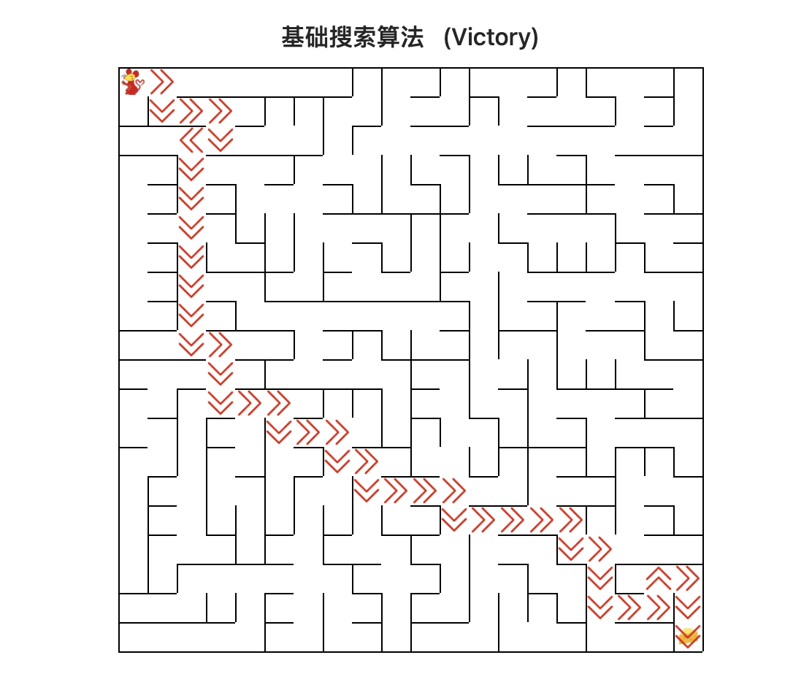
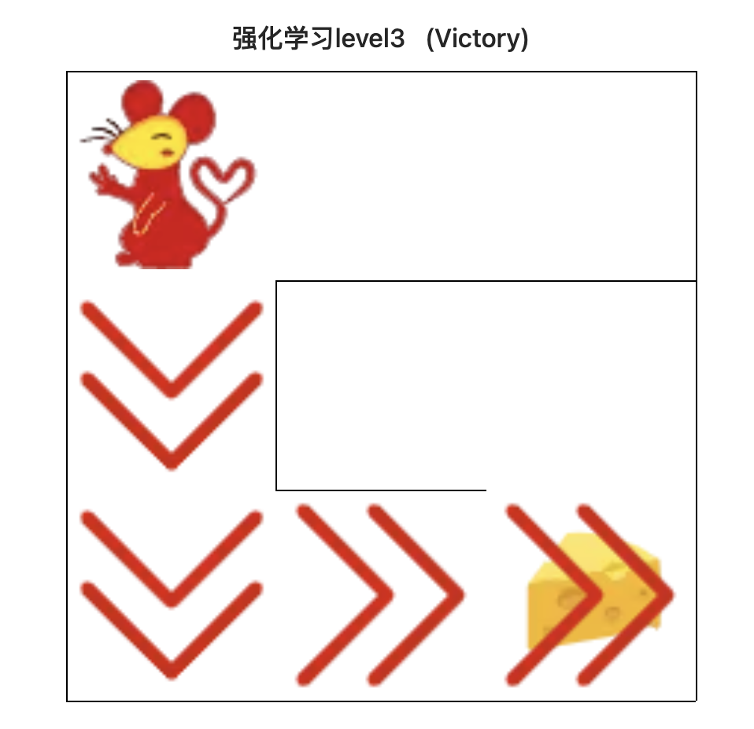
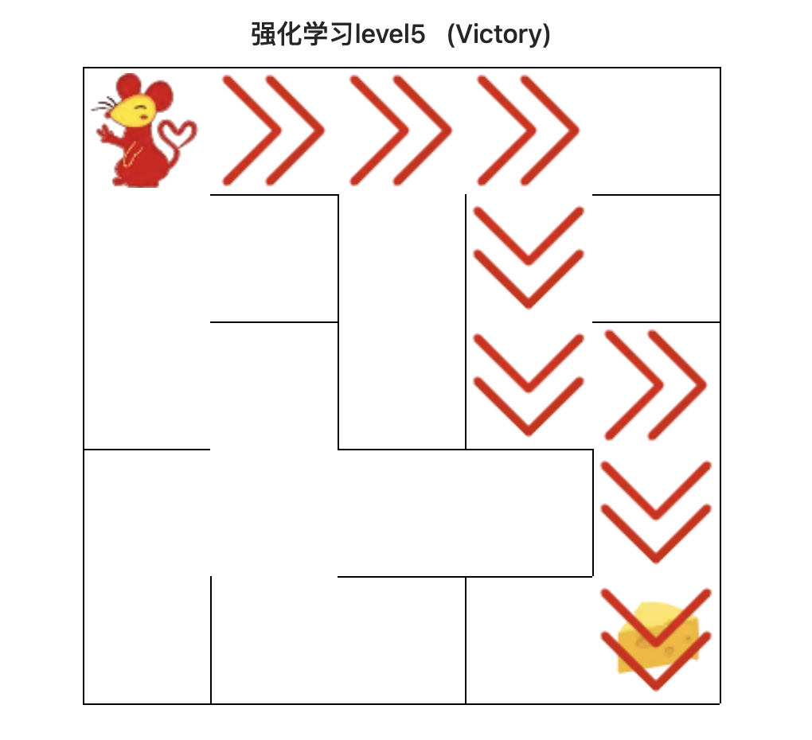
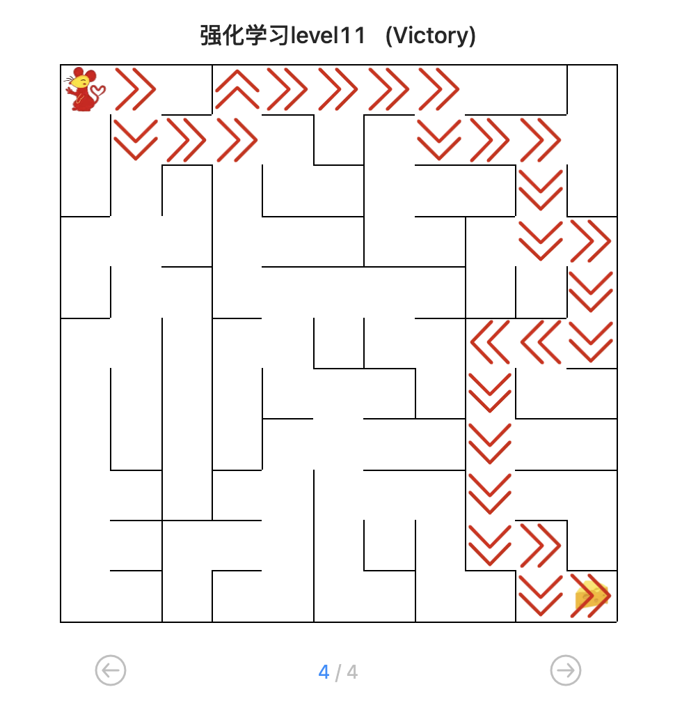

<center><h3>机器人自动走迷宫
  </h3></center>

<center>3190103683 张嘉浩
  </center>
#### 实验介绍

##### 1.1 实验内容

在本实验中，分别使用基础搜索算法和 Deep QLearning 算法，完成机器人自动走迷宫。


如上图所示，左上角的红色椭圆既是起点也是机器人的初始位置，右下角的绿色方块是出口。        游戏规则为：从起点开始，通过错综复杂的迷宫，到达目标点(出口)。        
+ 在任一位置可执行动作包括：向上走 `'u'`、向右走 `'r'`、向下走 `'d'`、向左走 `'l'`。

+ 执行不同的动作后，根据不同的情况会获得不同的奖励，具体而言，有以下几种情况。
    - 撞墙
    - 走到出口
    - 其余情况
    
+ 需要您分别实现**基于基础搜索算法**和 **Deep QLearning 算法**的机器人，使机器人自动走到迷宫的出口。

##### 1.2 实验要求

+ 使用 Python 语言。
+ 使用基础搜索算法完成机器人走迷宫。
+ 使用 Deep QLearning 算法完成机器人走迷宫。
+ 算法部分需要自己实现，不能使用现成的包、工具或者接口。

##### 1.3 实验环境

可以使用 Python 实现基础算法的实现， 使用 Keras、PyTorch等框架实现 Deep QLearning 算法。

##### 1.4 参考资料

+  强化学习入门MDP：https://zhuanlan.zhihu.com/p/25498081
+ QLearning 示例：http://mnemstudio.org/path-finding-q-learning-tutorial.htm
+ QLearning 知乎解释：https://www.zhihu.com/question/26408259
+ DeepQLearning：https://files.momodel.cn/Playing%20Atari%20with%20Deep%20Reinforcement%20Learning.pdf

---

#### 实验内容

##### 2.1 Maze 类介绍

**2.1.1 创建迷宫**

通过迷宫类 Maze 可以随机创建一个迷宫。

1. 使用  Maze(maze_size=size)  来随机生成一个 size * size 大小的迷宫。
2. 使用 print() 函数可以输出迷宫的 size 以及画出迷宫图
3. 红色的圆是机器人初始位置
4. 绿色的方块是迷宫的出口位置

```python
# 创建迷宫并展示
maze = Maze(maze_size=10) # 随机生成迷宫
print(maze)
```


**2.1.2 重要的成员方法**

在迷宫中已经初始化一个机器人，你要编写的算法实现在给定条件下控制机器人移动至目标点。

Maze 类中重要的成员方法如下：

> + `sense_robot()` ：获取机器人在迷宫中目前的位置
> + `move_robot(direction)` ：根据输入方向移动默认机器人
> + `can_move_actions(position)`：获取当前机器人可以移动的方向
> + `position`：迷宫中任一处的坐标点 
> + `is_hit_wall(self, location, direction)`：判断该移动方向是否撞墙
> + `location, direction`：当前位置和要移动的方向
> + `return`：True(撞墙) / False(不撞墙)
> + `draw_maze()`：画出当前的迷宫

随机移动机器人，并记录下获得的奖励，展示出机器人最后的位置。

```python
import random

rewards = [] # 记录每走一步的奖励值
actions = [] # 记录每走一步的移动方向

# 循环、随机移动机器人10次，记录下奖励
for i in range(10):
    valid_actions = maze.can_move_actions(maze.sense_robot())
    action = random.choice(valid_actions)
    rewards.append(maze.move_robot(action))
    actions.append(action)
```


##### 2.2 基础搜索算法介绍（广度优先搜索算法）

对于迷宫游戏，常见的三种的搜索算法有广度优先搜索、深度优先搜索和最佳优先搜索（A*)。

在下面的代码示例中，将实现广度优先搜索算法；主要通过建立一颗搜索树并进行层次遍历实现。
> - 每个节点表示为以 `Class SearchTree` 实例化的对象；
>
> - `valid_actions():` 用以获取机器人可以行走的位置（即不能穿墙）；
> - `expand():` 对于未拓展的子节点进行拓展；
> - `backpropagation():` 回溯搜索路径。


**2.2.1 算法具体步骤**

首先以机器人起始位置建立根节点，并入队；接下来不断重复以下步骤直到判定条件:

> 将队首节点的位置标记已访问；判断队首是否为目标位置(出口)， **是**则终止循环并记录回溯路径
>
> 判断队首节点是否为叶子节点，**是**则拓展该叶子节点
>
> 如果队首节点有子节点，则将每个子节点插到队尾
>
> 将队首节点出队


**2.3 强化学习算法介绍**

强化学习作为机器学习算法的一种，其模式也是让智能体在“训练”中学到“经验”，以实现给定的任务。但不同于监督学习与非监督学习，在强化学习的框架中，我们更侧重通过智能体与环境的**交互**来学习。通常在监督学习和非监督学习任务中，智能体往往需要通过给定的训练集，辅之以既定的训练目标（如最小化损失函数），通过给定的学习算法来实现这一目标。然而在强化学习中，智能体则是通过其与环境交互得到的奖励进行学习。 这个环境可以是虚拟的（如虚拟的迷宫），也可以是真实的（自动驾驶汽车在真实道路上收集数据）。在强化学习中有五个核心组成部分，它们分别是：环境、智能体、状态、动作和奖励。

在某一时间节点 $t$：
- 智能体在从环境中感知其所处的状态 $s_t$
- 智能体根据某些准则选择动作 $a_t$
- 环境根据智能体选择的动作，向智能体反馈奖励 $r_{t+1}$

通过合理的学习算法，智能体将在这样的问题设置下，成功学到一个在状态 $s_t$ 选择动作 $a_t$ 的策略 $\pi (s_t) = a_t$。


**Pytorch** 读取数据虽然特别灵活，但是还是具有特定的流程的，它的操作顺序为：

+ 创建一个 `Dataset` 对象，该对象如果现有的 `Dataset` 不能够满足需求，我们也可以自定义 `Dataset`，通过继承 `torch.utils.data.Dataset`。在继承的时候，需要 `override` 三个方法。
    + `__init__`： 用来初始化数据集
    + `__getitem__`：给定索引值，返回该索引值对应的数据；它是python built-in方法，其主要作用是能让该类可以像list一样通过索引值对数据进行访问
    + `__len__`：用于len(Dataset)时能够返回大小
+ 创建一个 `DataLoader` 对象
+ 不停的 循环 这个 `DataLoader` 对象


##### 2.5 QLearning 算法

Q-Learning 是一个值迭代算法。与策略迭代算法不同，值迭代算法会计算每个”状态“或是”状态-动作“的值或是效用，然后在执行动作的时候，会设法最大化这个值。因此，对每个状态值的准确估计，是值迭代算法的核心。通常会考虑**最大化动作的长期奖励**，即不仅考虑当前动作带来的奖励，还会考虑动作长远的奖励。

**2.5.1 Q 值的计算与迭代**

Q-learning 算法将状态和动作构建成一张 $Q-table$ 表来存储 Q 值，Q 表的行代表状态，列代表动作：


在 Q-Learning 算法中，将这个长期奖励记为 Q 值，其中会考虑每个 ”状态-动作“ 的 Q 值，具体而言，它的计算公式为：

$$
Q(s_{t},a) = R_{t+1} + \gamma \times\max_a Q(a,s_{t+1})
$$

也就是对于当前的“状态-动作” $(s_{t},a)$，考虑执行动作 $a$ 后环境奖励 $R_{t+1}$，以及执行动作 $a$ 到达 $s_{t+1}$后，执行任意动作能够获得的最大的Q值 $\max_a Q(a,s_{t+1})$，$\gamma$ 为折扣因子。

计算得到新的 Q 值之后，一般会使用更为保守地更新 Q 表的方法，即引入松弛变量 $alpha$ ，按如下的公式进行更新，使得 Q 表的迭代变化更为平缓。

$$
Q(s_{t},a) = (1-\alpha) \times Q(s_{t},a) + \alpha \times(R_{t+1} + \gamma \times\max_a Q(a,s_{t+1}))
$$

**2.5.2 机器人动作的选择**

在强化学习中，**探索-利用** 问题是非常重要的问题。具体来说，根据上面的定义，会尽可能地让机器人在每次选择最优的决策，来最大化长期奖励。但是这样做有如下的弊端：    
1. 在初步的学习中，Q 值是不准确的，如果在这个时候都按照 Q 值来选择，那么会造成错误。
2. 学习一段时间后，机器人的路线会相对固定，则机器人无法对环境进行有效的探索。


因此需要一种办法，来解决如上的问题，增加机器人的探索。通常会使用 **epsilon-greedy** 算法：

1. 在机器人选择动作的时候，以一部分的概率随机选择动作，以一部分的概率按照最优的 Q 值选择动作。
2. 同时，这个选择随机动作的概率应当随着训练的过程逐步减小。
   

**2.5.3  Q-Learning 算法的学习过程**


**2.5.4 Robot 类**

在本作业中提供了 QRobot 类，其中实现了 Q 表迭代和机器人动作的选择策略，可通过 `from QRobot import QRobot` 导入使用。

```python
from QRobot import QRobot
from Maze import Maze
maze = Maze(maze_size=5) # 随机生成迷宫
robot = QRobot(maze) # 记得将 maze 变量修改为你创建迷宫的变量名
action, reward = robot.train_update() # QLearning 算法一次Q值迭代和动作选择
```

 **2.5.5 Runner 类**

QRobot 类实现了 QLearning 算法的 Q 值迭代和动作选择策略。在机器人自动走迷宫的训练过程中，需要不断的使用 QLearning 算法来迭代更新 Q 值表，以达到一个“最优”的状态，因此封装好了一个类 Runner 用于机器人的训练和可视化。可通过 `from Runner import Runner` 导入使用。

**Runner 类的核心成员方法：**

1. `run_training(training_epoch, training_per_epoch=150)`: 训练机器人，不断更新 Q 表，并讲训练结果保存在成员变量 `train_robot_record` 中

2. `run_testing()`：测试机器人能否走出迷宫

3. `generate_gif(filename)`：将训练结果输出到指定的 gif 图片中

4. `plot_results()`：以图表展示训练过程中的指标：Success Times、Accumulated Rewards、Runing Times per Epoch

**设定训练参数、训练、查看结果**

```python
from QRobot import QRobot
from Maze import Maze
from Runner import Runner

"""  Qlearning 算法相关参数： """

epoch = 10  # 训练轮数
epsilon0 = 0.5  # 初始探索概率
alpha = 0.5  # 公式中的 ⍺
gamma = 0.9  # 公式中的 γ
maze_size = 5  # 迷宫size

""" 使用 QLearning 算法训练过程 """

g = Maze(maze_size=maze_size)
r = QRobot(g, alpha=alpha, epsilon0=epsilon0, gamma=gamma)

runner = Runner(r)
runner.run_training(epoch, training_per_epoch=int(maze_size * maze_size * 1.5))
```


#### 题目一：实现基础搜索算法

* 题目要求： 任选深度优先搜索算法、最佳优先搜索 A* 算法其中一种实现机器人走迷宫

* 输入：迷宫

* 输出：到达目标点的路径

基础搜索算法如下：

```python
def my_search(maze):
    path = []
    visited = {}
    path_t = []
    direction = ['u', 'r', 'd', 'l']
    
    def reverse(d):
        idx = direction.index(d)
        return direction[(idx + 2) % 4]
    
    def dfs():
        nonlocal path
        if path:
            return
        location = maze.sense_robot()
        if location == maze.destination:
            path = [_ for _ in path_t]
        
        visited[location] = True
        for d in maze.can_move_actions(location):
            maze.move_robot(d)
            location = maze.sense_robot()
            if location not in visited:
                path_t.append(d)
                dfs()
                del path_t[-1]
            maze.move_robot(reverse(d))   
    dfs()
    return path
```


#### 题目二: 实现 Deep QLearning 算法

##### 2.6 DQN 算法介绍

强化学习是一个反复迭代的过程，每一次迭代要解决两个问题：给定一个策略求值函数，和根据值函数来更新策略。而 DQN 算法使用神经网络来近似值函数。([DQN 论文地址](https://files.momodel.cn/Playing%20Atari%20with%20Deep%20Reinforcement%20Learning.pdf))

+ **DQN 算法流程**


+ **DQN 算法框架图**


##### 1. 实现简单的 DQNRobot

作业中提供了简单的 DQNRobot 实现，其中依靠简单的两层全连接神经网络决策动作

> 输入：机器人当前的位置坐标
>
> 输出：执行四个动作（up、right、down、left）的评估分数

```python
from torch_py.MinDQNRobot import MinDQNRobot as TorchRobot # PyTorch版本
from keras_py.MinDQNRobot import MinDQNRobot as KerasRobot # Keras版本

import matplotlib.pyplot as plt
from Maze import Maze
from Runner import Runner
import os

os.environ["KMP_DUPLICATE_LIB_OK"] = "TRUE"  # 允许重复载入lib文件

maze = Maze(maze_size=5) 

"""选择keras版本或者torch版本的机器人, MinRobot是尽量选择reward值最小的动作，对象初始化过程中修改了maze的reward参数"""
# robot = KerasRobot(maze=maze)
robot = TorchRobot(maze=maze)

print(robot.maze.reward) # 输出最小值选择策略的reward值

"""开启金手指，获取全图视野"""
robot.memory.build_full_view(maze=maze) # 

"""training by runner"""
runner = Runner(robot=robot)
runner.run_training(training_epoch=10, training_per_epoch=75)

"""Test Robot"""
robot.reset()
for _ in range(25):
    a, r = robot.test_update()
    print("action:", a, "reward:", r)
    if r == maze.reward["destination"]:
        print("success")
        break
```


##### 2. 实现你自己的 DQNRobot

**题目要求:** 编程实现 DQN 算法在机器人自动走迷宫中的应用

> **输入:** 由 Maze 类实例化的对象 maze
>
> **要求不可更改的成员方法：**train_update()、test_update() **注：不能修改该方法的输入输出及方法名称，测试评分会调用这两个方法**。
>
> **补充1:**若要自定义的参数变量，在 \_\_init\_\_() 中以 `self.xxx = xxx` 创建即可
>
> **补充2:**实现你自己的DQNRobot时，要求继承 QRobot 类，QRobot 类包含了某些固定的方法如reset(重置机器人位置),sense_state(获取机器人当前位置).

```python
class Robot(TorchRobot):

    def __init__(self, maze):
        """
        初始化 Robot 类
        :param maze:迷宫对象
        """
        super(Robot, self).__init__(maze)
        maze.set_reward(reward={
            "hit_wall": 10.,
            "destination": -maze.maze_size ** 2 * 4.,
            "default": 1.,
        })
        self.maze = maze
        self.epsilon = 0
        """开启金手指，获取全图视野"""
        self.memory.build_full_view(maze=maze)
        self.loss_list = self.train()   

    def train(self):
        loss_list = []
        batch_size = len(self.memory)
        
        # 训练，直到能走出这个迷宫
        while True:
            loss = self._learn(batch=batch_size)
            loss_list.append(loss)
            success = False
            self.reset()
            for _ in range(self.maze.maze_size ** 2 - 1):
                a, r = self.test_update()
            #     print("action:", a, "reward:", r)
                if r == self.maze.reward["destination"]:
                    return loss_list

    def train_update(self):
        state = self.sense_state()
        action = self._choose_action(state)
        reward = self.maze.move_robot(action)
        return action, reward
    
    def test_update(self):
        state = np.array(self.sense_state(), dtype=np.int16)
        state = torch.from_numpy(state).float().to(self.device)

        self.eval_model.eval()
        with torch.no_grad():
            q_value = self.eval_model(state).cpu().data.numpy()

        action = self.valid_action[np.argmin(q_value).item()]
        reward = self.maze.move_robot(action)
        return action, reward
```

---

#### 训练结果

##### 3.1 题目一的训练结果如下：



##### 3.2 题目二的结果如下：










##### 3.2 体会心得

本实验相较于其他几个实验，理论性更强，形式也与之前完全不同。第一题主要在题目所给的代码上修改出栈入栈方式实现基础的搜索算法，第二题在训练的过程中也是开启了 “金手指” 直接获取了地图的全局信息，而不是用探索的方法进行学习。我也修改了奖励的方式，将奖励与迷宫的大小设为正比，防止出现迷宫过大而奖励过小的状况。那么在测试的过程中，第一问所用的基础搜索算法所用的时间远远少于第二题的人工智能算法，所以说在实际的应用场景里，还是要根据需求选择合适的算法。
