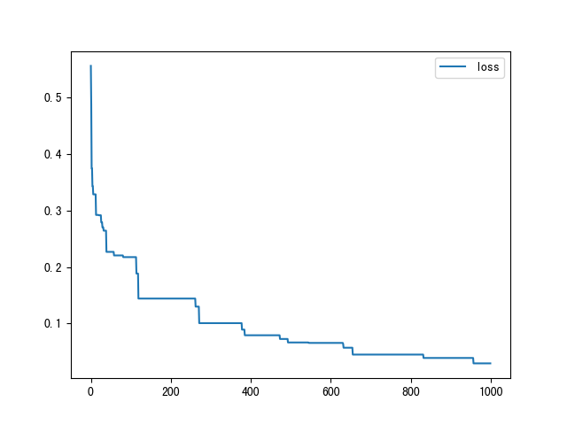

<center><h3>目标检测：口罩佩戴检测
  </h3></center>


<center>3190103683 张嘉浩
  </center>
#### 实验介绍

##### 1.1 实验背景

今年一场席卷全球的新型冠状病毒给人们带来了沉重的生命财产的损失。有效防御这种传染病毒的方法就是积极佩戴口罩。我国对此也采取了严肃的措施，在公共场合要求人们必须佩戴口罩。在本次实验中，我们要建立一个目标检测的模型，可以识别图中的人是否佩戴了口罩。

##### 1.2 实验要求

1）建立深度学习模型，检测出图中的人是否佩戴了口罩，并将其尽可能调整到最佳状态。
2）学习经典的模型 MTCNN 和 MobileNet 的结构。
3）学习训练时的方法。

##### 1.3 实验环境

可以使用基于 Python 的 OpenCV 、PIL 库进行图像相关处理，使用 Numpy 库进行相关数值运算，使用 Pytorch 等深度学习框架训练模型等。

##### 1.4 实验思路

针对目标检测的任务，可以分为两个部分：目标识别和位置检测。通常情况下，特征提取需要由特有的特征提取神经网络来完成，如 VGG、MobileNet、ResNet 等，这些特征提取网络往往被称为 Backbone 。而在 BackBone 后面接全连接层(FC)就可以执行分类任务。但 FC 对目标的位置识别乏力。经过算法的发展，当前主要以特定的功能网络来代替 FC 的作用，如 Mask-Rcnn、SSD、YOLO 等。我们选择充分使用已有的人脸检测的模型，再训练一个识别口罩的模型，从而提高训练的开支、增强模型的准确率。


#### 数据集介绍

##### 2.1 数据集介绍

数据信息存放在 `/datasets/5f680a696ec9b83bb0037081-momodel/data` 文件夹下。    
该文件夹主要有文件夹 `image`、文件 `train.txt` 、文件夹 `keras_model_data` 和文件夹 `mindspore_model_data`共四部分：

> - `image` 文件夹：图片分成两类，戴口罩的和没有戴口罩的  
>
> - `train.txt`：存放的是 image 文件夹下对应图片的标签
>
> - `keras_model_data` 文件夹：存放 keras 框架相关预训练好的模型
>
> - `mindspore_model_data` 文件夹：存放 mindspore 框架相关预训练好的模型

##### 2.2 调整图片尺寸

```python
def letterbox_image(image, size):
    new_image = cv2.resize(image, size, interpolation=cv2.INTER_AREA)
    return new_image
```
##### 2.3 制作训练时所需的批量数据集

**Pytorch** 读取数据虽然特别灵活，但是还是具有特定的流程的，它的操作顺序为：

+ 创建一个 `Dataset` 对象，该对象如果现有的 `Dataset` 不能够满足需求，我们也可以自定义 `Dataset`，通过继承 `torch.utils.data.Dataset`。在继承的时候，需要 `override` 三个方法。
    + `__init__`： 用来初始化数据集
    + `__getitem__`：给定索引值，返回该索引值对应的数据；它是python built-in方法，其主要作用是能让该类可以像list一样通过索引值对数据进行访问
    + `__len__`：用于len(Dataset)时能够返回大小
+ 创建一个 `DataLoader` 对象
+ 不停的循环 这个 `DataLoader` 对象


#### MTCNN：人脸检测

##### 3.1  MTCNN 解读

文献地址：[Joint Face Detection and Alignment using Multi-task Cascaded Convolutional Networks](https://kpzhang93.github.io/MTCNN_face_detection_alignment/  ) 


论文的主要贡献： 

> - 三阶段的级联（cascaded）架构  
>
> - coarse-to-fine 的方式  
>
> - new online hard sample mining 策略  
>
> - 同时进行人脸检测和人脸对齐
>
> - state-of-the-art 性能  


#### 口罩识别

##### 4.1 手动调整学习率

学习率的手动设置可以使模型训练更加高效。这里我们设置当模型在两轮迭代后，准确率没有上升，就调整学习率。

##### 4.3 训练模型

```python
best_loss = 1e9
best_model_weights = copy.deepcopy(model.state_dict())
loss_list = []  # 存储损失函数值
for epoch in range(epochs):
    model.train()

    for batch_idx, (x, y) in tqdm(enumerate(train_data_loader, 1)):
        x = x.to(device)
        y = y.to(device)
        pred_y = model(x)
        loss = criterion(pred_y, y)
        optimizer.zero_grad()
        loss.backward()
        optimizer.step()

        if loss < best_loss:
            best_model_weights = copy.deepcopy(model.state_dict())
            best_loss = loss
            
        loss_list.append(loss)
```


#### 作业

##### 5.1 训练函数如下

```python
import warnings
warnings.filterwarnings("ignore")
import cv2
from PIL import Image
import numpy as np
import copy
import matplotlib.pyplot as plt
from tqdm.auto import tqdm
import torch
import torch.nn as nn
import torch.optim as optim
from torchvision.datasets import ImageFolder
import torchvision.transforms as T
from torch.utils.data import DataLoader

# 导入已经写好的Python文件
from torch_py.Utils import plot_image
from torch_py.MTCNN.detector import FaceDetector
from torch_py.MobileNetV1 import MobileNetV1
from torch_py.FaceRec import Recognition

# 1.加载数据并进行数据处理
# 调整图片尺寸
def letterbox_image(image, size):
    """
    调整图片尺寸
    :param image: 用于训练的图片
    :param size: 需要调整到网络输入的图片尺寸
    :return: 返回经过调整的图片
    """
    new_image = cv2.resize(image, size, interpolation=cv2.INTER_AREA)
    return new_image


# 制作训练时所需的批量数据集
def processing_data(data_path, height=224, width=224, batch_size=32, test_split=0.1):
    """
    数据处理部分
    :param data_path: 数据路径
    :param height:高度
    :param width: 宽度
    :param batch_size: 每次读取图片的数量
    :param test_split: 测试集划分比例
    :return: 
    """
    transforms = T.Compose(
        [
            T.Resize((height, width)),
            T.RandomHorizontalFlip(0.1),  # 进行随机水平翻转
            T.RandomVerticalFlip(0.1),  # 进行随机竖直翻转
            T.ToTensor(),  # 转化为张量
            T.Normalize([0], [1]),  # 归一化
        ]
    )

    dataset = ImageFolder(data_path, transform=transforms)
    # 划分数据集
    train_size = int((1 - test_split) * len(dataset))
    test_size = len(dataset) - train_size
    train_dataset, test_dataset = torch.utils.data.random_split(
        dataset, [train_size, test_size]
    )
    # 创建一个 DataLoader 对象
    train_data_loader = DataLoader(train_dataset, batch_size=batch_size, shuffle=True)
    valid_data_loader = DataLoader(test_dataset, batch_size=batch_size, shuffle=True)
    return train_data_loader, valid_data_loader


# 绘制图片
def show_tensor_img(img_tensor):
    img = img_tensor[0].data.numpy()
    img = np.swapaxes(img, 0, 2)
    img = np.swapaxes(img, 0, 1)
    img = np.array(img)
    plot_image(img)


# 2.如果有预训练模型，则加载预训练模型；如果没有则不需要加载
# MTCNN权重文件
pnet_path = "./torch_py/MTCNN/weights/pnet.npy"
rnet_path = "./torch_py/MTCNN/weights/rnet.npy"
onet_path = "./torch_py/MTCNN/weights/onet.npy"
data_path = "./datasets/5f680a696ec9b83bb0037081-momodel/data/image"

# 加载 MobileNet 的预训练模型权
device = torch.device("cuda:0") if torch.cuda.is_available() else torch.device("cpu")
train_data_loader, valid_data_loader = processing_data(
    data_path=data_path, height=160, width=160, batch_size=32
)
modify_x, modify_y = torch.ones((32, 3, 160, 160)), torch.ones((32))

epochs = 30
model = MobileNetV1(classes=2).to(device)
optimizer = optim.Adam(model.parameters(), lr=1e-3)  # 优化器
print("加载完成...")

# 3.创建模型和训练模型，训练模型时尽量将模型保存在 results 文件夹
# 学习率下降的方式，acc三次不下降就下降学习率继续训练，衰减学习率
scheduler = optim.lr_scheduler.ReduceLROnPlateau(
    optimizer, "max", factor=0.01, patience=2
)
# 损失函数
criterion = nn.CrossEntropyLoss()
best_loss = 1e9
best_model_weights = copy.deepcopy(model.state_dict())
loss_list = []  # 存储损失函数值
for epoch in range(epochs):
    model.train()
    for batch_idx, (x, y) in enumerate(train_data_loader, 1):
        x = x.to(device)
        y = y.to(device)
        pred_y = model(x)
        loss = criterion(pred_y, y)
        optimizer.zero_grad()
        loss.backward()
        optimizer.step()
        if loss < best_loss:
            best_model_weights = copy.deepcopy(model.state_dict())
            best_loss = loss
    loss_list.append(best_loss)
    print(
        "step:" + str(epoch + 1) + "/" + str(epochs) + " || Total Loss: %.4f" % (loss)
    )
torch.save(model.state_dict(), "./results/temp.pth")
print("Finish Training.")
# 展示模型训练过程
plt.plot(loss_list, label="loss")
plt.legend()
plt.show()

# 4.评估模型，将自己认为最佳模型保存在 result 文件夹，其余模型备份在项目中其它文件夹，方便您加快测试通过。
# 检测图片中人数及戴口罩的人数
img = Image.open("test.jpg")
detector = FaceDetector()
recognize = Recognition(model_path="results/temp.pth")
draw, all_num, mask_nums = recognize.mask_recognize(img)
plt.imshow(draw)
plt.show()
print("all_num:", all_num, "mask_num", mask_nums)
```


##### 5.2 预测函数如下

```python
import warnings
# 忽视警告
warnings.filterwarnings('ignore')
import numpy as np
import matplotlib.pyplot as plt
from torch_py.Utils import plot_image
from torch_py.MTCNN.detector import FaceDetector
from torch_py.MobileNetV1 import MobileNetV1
from torch_py.FaceRec import Recognition
from torch_py.FaceRec import Recognition
from PIL import Image
import cv2

model_path = "./results/temp.pth"

def predict(img):
    """
    加载模型和模型预测
    :param img: cv2.imread 图像
    :return: 预测的图片中的总人数、其中佩戴口罩的人数
    """
    if isinstance(img, np.ndarray):
        # 转化为 PIL.JpegImagePlugin.JpegImageFile 类型
        img = Image.fromarray(cv2.cvtColor(img,cv2.COLOR_BGR2RGB))
    
    recognize = Recognition(model_path)
    img, all_num, mask_num = recognize.mask_recognize(img)
    plt.imshow(img)
    plt.show()
    return all_num,mask_num

if __name__ == '__main__':
    # 输入图片路径和名称
    img = cv2.imread("test1.jpg")
    img = cv2.cvtColor(img, cv2.COLOR_BGR2RGB)
    all_num, mask_num = predict(img)
    # 打印预测该张图片中总人数以及戴口罩的人数
    print(all_num, mask_num)
```


#### 训练结果

##### 6.1 训练结果

最佳损失值曲线图如下图所示，可以看到最佳损失值先快速下降后缓慢减小，在平台中最佳训练结果为94分。




##### 6.2 体会心得

本次作业的代码框架在notebook中已经大致给出，我所做的工作主要是在已有框架的基础上对模型进行调优。参数的调整并不是盲目的，而要根据学习曲线、损失值等指标的意义及其对模型的影响进行针对性的调整。